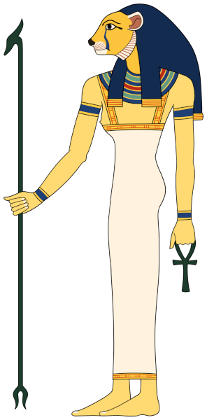

# Mafdet UI

Demo UI app for LocalDev solution. This app is a sort of census for cats (yeah, cats).

`Mafdet` (also Mefdet, Maftet) was a goddess in the ancient Egyptian religion. She was often depicted wearing a skin of a cheetah, and protected against the bite of snakes and scorpions (just like our cats do).

`Mafdet - source Wikipedia`

## Running locally (as part of LocalDev)

Mafdet UI was build with [LocalDev](https://github.com/SeMiCorp/mafdet-localdev) in mind.
It is ready out-of-the-box sort of speaking.

LocalDev solution contain `latest` Docker images of Mafdet UI.

It is possible to run Mafdet UI along with LocalDev solution and be able to work with the code. To do that, you should:

- Clone  [LocalDev](https://github.com/SeMiCorp/mafdet-localdev) repository
- Run LocalDev with `docker compose up -d` command
- Wait until all services are running
- Stop Docker `web` (name `web-1`) service from within LocalDev
- Run `docker compose up -d` from within Mafdet UI
- Wait for service to start.
- Now you can edit Mafdet UI code and see changes instantly in the browser after saving edited file.

## Running locally (manually)
- install dependencies with `npm install`
- run `npm start` This will start Keycloak docker image (check `keycloak\docker-compose.yml` file) for more details like ports etc.

## Keycloak Users
- username: `mafdetuser` password `password123`